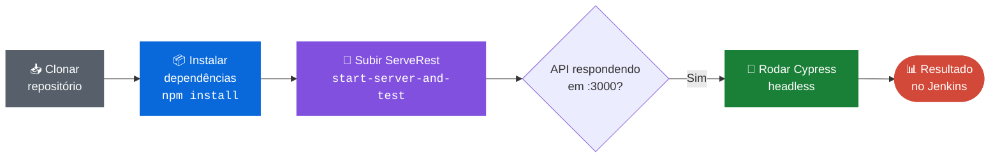
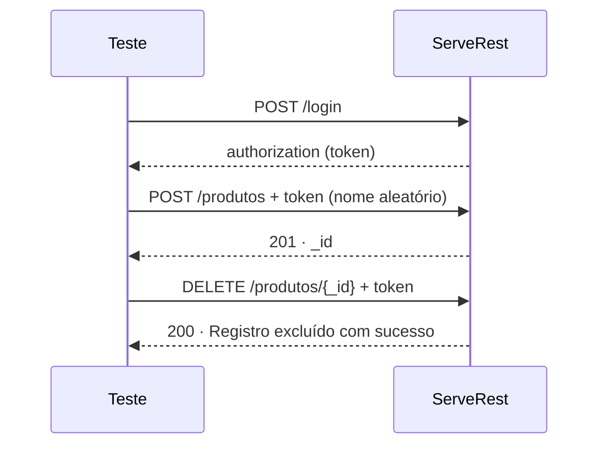
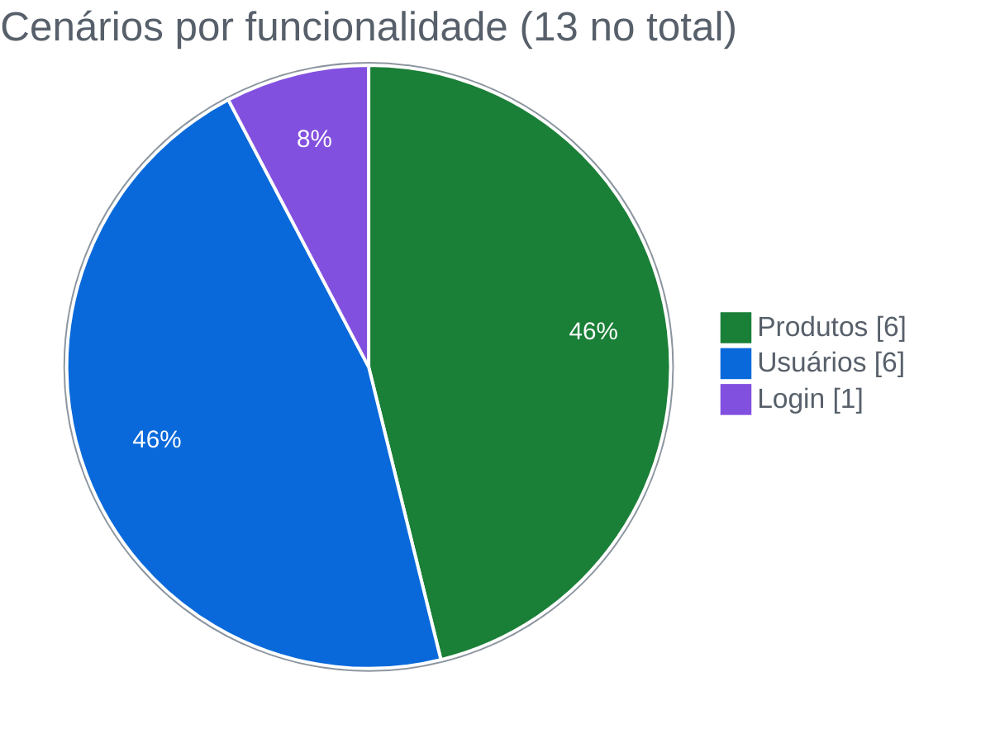
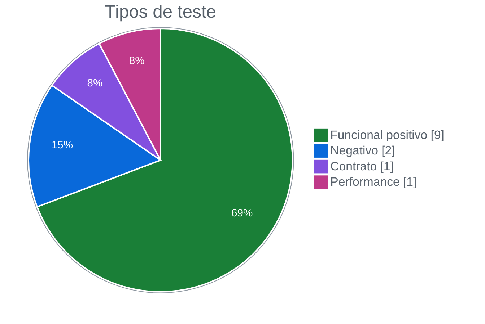
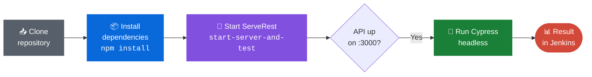
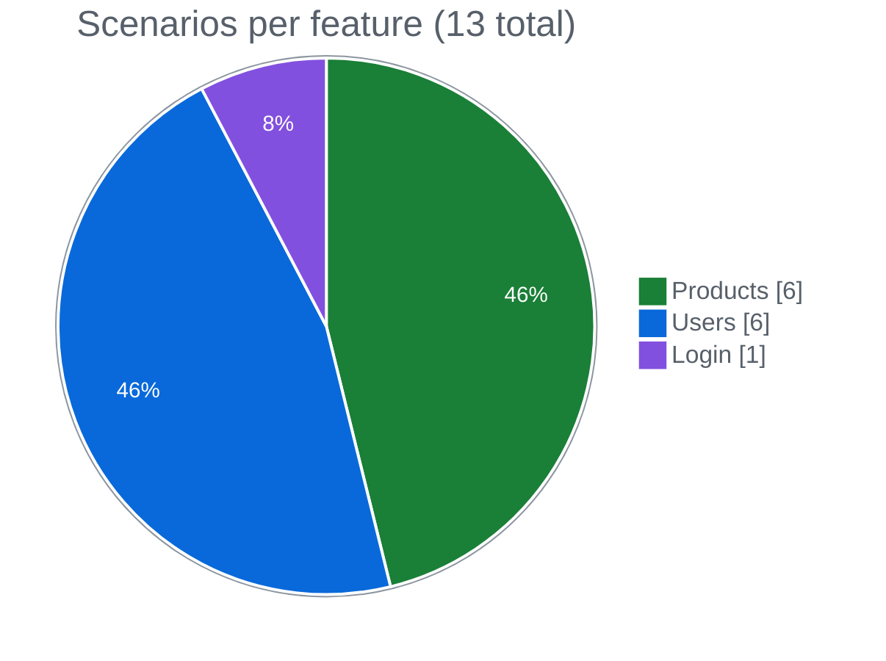
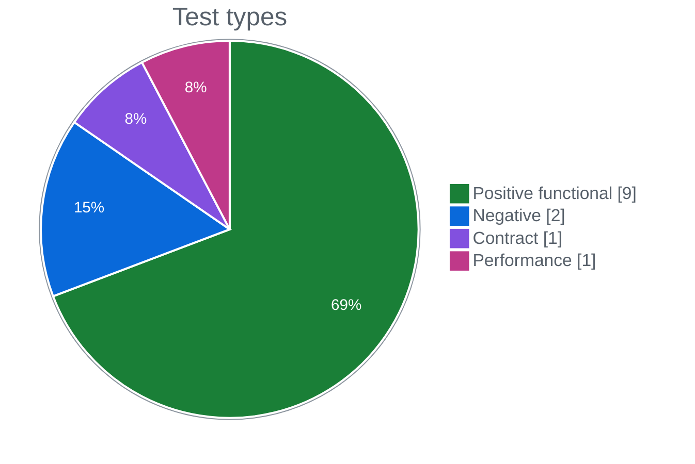

<div align="center">

# 🔁 ServeRest · Testes de API com Cypress e Pipeline Jenkins

**Automatizei os testes de usuários, produtos e login de uma API REST, com validação de contrato e execução contínua num pipeline Jenkins**


🇧🇷 [Português](#-português) · 🇺🇸 [English](#-english)

</div>

---

## 🇧🇷 Português

### 🎯 Objetivo

Depois de explorar a API ServeRest no [Postman](https://github.com/gustavoanderson/postman-serverest), levei os testes para código e dei o passo seguinte: **fazer a suíte rodar sozinha num pipeline**, sem ninguém precisar abrir o Cypress na mão.

O projeto teve três frentes:

1. **Testes funcionais** do CRUD de usuários e de produtos, e do login
2. **Validação de contrato** da resposta com Joi, para detectar mudança na estrutura da API
3. **Integração contínua** com Jenkins: clonar, instalar, subir a API e rodar os testes

### 🧭 Estratégia

#### Pipeline

Configurei um `Jenkinsfile` declarativo com três estágios. O ponto-chave foi o `start-server-and-test`: ele sobe a ServeRest, espera a API responder e só então dispara o Cypress, sem nenhum passo manual.



Ajustei o pipeline para rodar num **agente Windows**, trocando os comandos `sh` por `bat`.

#### Testes independentes

Nos cenários de edição e exclusão, crio o registro dentro do próprio teste com comandos customizados, pego o `_id` que a API devolve e opero em cima dele:



### 🧪 Cobertura



| Funcionalidade | Cenário | Método | Tipo |
|---|---|:-:|:-:|
| 👤 Usuários | Validar contrato da listagem | `GET` | 📐 Contrato |
| 👤 Usuários | Listar usuários | `GET` | ✅ Positivo |
| 👤 Usuários | Cadastrar usuário | `POST` | ✅ Positivo |
| 👤 Usuários | Cadastrar com e-mail já usado | `POST` | ⚠️ Negativo |
| 👤 Usuários | Editar usuário criado no teste | `PUT` | ✅ Positivo |
| 👤 Usuários | Excluir usuário criado no teste | `DELETE` | ✅ Positivo |
| 📦 Produtos | Listar produtos **em menos de 20 ms** | `GET` | ⏱️ Performance |
| 📦 Produtos | Cadastrar produto | `POST` | ✅ Positivo |
| 📦 Produtos | Cadastrar produto com nome repetido | `POST` | ⚠️ Negativo |
| 📦 Produtos | Editar produto existente | `PUT` | ✅ Positivo |
| 📦 Produtos | Editar produto criado no teste | `PUT` | ✅ Positivo |
| 📦 Produtos | Excluir produto criado no teste | `DELETE` | ✅ Positivo |
| 🔐 Login | Login com sucesso | `POST` | ✅ Positivo |



### 🧰 Técnicas que apliquei

| Técnica | Implementação |
|---|---|
| Validação de contrato | Schema **Joi** aplicado à resposta com `validateAsync` |
| Asserção de performance | `expect(response.duration).to.be.lessThan(20)` |
| Autenticação reutilizável | `cy.token()` no `before` da suíte de produtos |
| Comandos customizados | `cy.token()`, `cy.cadastrarProduto()` e `cy.cadastrarUsuario()` |
| Massa aleatória | Nomes e e-mails com `Math.random()` para não colidir |
| Testes negativos | `failOnStatusCode: false` para validar o erro 400 |
| Orquestração de ambiente | `start-server-and-test` sobe a API antes da suíte |
| CI | `Jenkinsfile` declarativo com 3 estágios |

### 📈 Resultados

- **Automatizei 13 cenários** cobrindo os quatro métodos HTTP nos recursos de usuários e produtos, além do login.
- **Coloquei a suíte num pipeline Jenkins**, que clona o repositório, instala as dependências, sobe a API e roda os testes de ponta a ponta.
- **Fui além do status code:** a suíte valida o contrato da resposta com Joi e o tempo de resposta da listagem.
- **Protegi regras de negócio:** e-mail duplicado e produto com nome repetido precisam ser recusados, e os testes negativos garantem isso.

### 🚀 Onde esse trabalho se aplica

- **Qualidade contínua:** com o pipeline, os testes rodam a cada alteração, sem depender de alguém lembrar de executar.
- **Proteção contra quebra de integração:** a validação de contrato avisa quando a API muda a estrutura da resposta e o front deixaria de funcionar.
- **SLA de performance:** a asserção de tempo de resposta vira um alarme simples de degradação.
- **Portável para outras ferramentas de CI:** o mesmo fluxo (instalar → subir API → testar) se aplica a GitHub Actions, GitLab CI ou Azure DevOps.

### ▶️ Como executar

**Pré-requisito:** Node.js.

```bash
npm install

# sobe a ServeRest e roda os testes em sequência (mesmo comando do Jenkins)
npm run cy:run-ci

# ou, em dois terminais
npm start          # ServeRest em http://localhost:3000
npx cypress open   # modo interativo
```

**No Jenkins:** crie um job do tipo *Pipeline* apontando para este repositório. O `Jenkinsfile` na raiz define os estágios.

### 📁 Estrutura

```
├── Jenkinsfile                    # pipeline declarativo
├── cypress/
│   ├── contracts/
│   │   └── produtos.contract.js   # schema Joi
│   ├── e2e/
│   │   ├── exercicio-api.cy.js    # usuários
│   │   ├── login.cy.js
│   │   └── produtos.cy.js
│   └── support/commands.js        # token · cadastrarProduto · cadastrarUsuario
└── package.json                   # scripts cy:run-ci e start
```

---

## 🇺🇸 English

### 🎯 Goal

After exploring the ServeRest API in [Postman](https://github.com/gustavoanderson/postman-serverest), I moved the tests into code and took the next step: **making the suite run on its own in a pipeline**.

The project had three fronts: **functional tests** for users, products and login; **contract validation** with Joi; and **continuous integration** with Jenkins.

### 🧭 Strategy



I wrote a declarative `Jenkinsfile` with three stages. `start-server-and-test` starts ServeRest, waits for the API and only then runs Cypress. I also adapted the pipeline to a **Windows agent** (`bat` instead of `sh`).

For edit and delete scenarios, I create the record inside the test through custom commands, take the returned `_id` and operate on it, so tests don't depend on each other.

### 🧪 Coverage





### 📈 Results

- **I automated 13 scenarios** covering all four HTTP methods on users and products, plus login.
- **I put the suite in a Jenkins pipeline** that clones, installs, starts the API and runs the tests end to end.
- **I went beyond status codes:** the suite validates the response contract with Joi and the listing response time (< 20 ms).
- **I protected business rules:** duplicate emails and duplicate product names must be rejected.

### 🚀 Where this applies

- **Continuous quality:** tests run on every change, without anyone having to remember.
- **Integration safety:** contract validation flags when the API changes its response structure.
- **Performance SLA:** the response-time assertion works as a simple degradation alarm.
- **Portable CI:** the same flow (install → start API → test) fits GitHub Actions, GitLab CI or Azure DevOps.

### ▶️ How to run

```bash
npm install
npm run cy:run-ci   # starts ServeRest and runs the tests (same as Jenkins)
```

---

<div align="center">

Feito por **Gustavo Anderson** · QA Engineer
[](https://www.linkedin.com/in/gustavo-anderson)
[](https://github.com/gustavoanderson)

</div>
